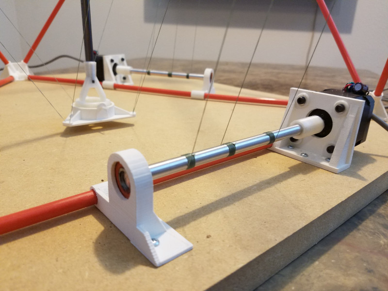

## Arcus3D-C1 Cable Printer

The Arcus3D-C1 Cable printer is open source hardware. This github repository hosts the OpenSCAD source in addition to rendered STL images for quick access.

Hardware designs (schematics and CAD) files are licensed under the [Creative Commons Attribution-ShareAlike 3.0 Unported License](http://creativecommons.org/licenses/by-sa/3.0/) and follow the terms of the [OSHW (Open-source hardware) Statement of Principles 1.0.](http://freedomdefined.org/OSHW)
